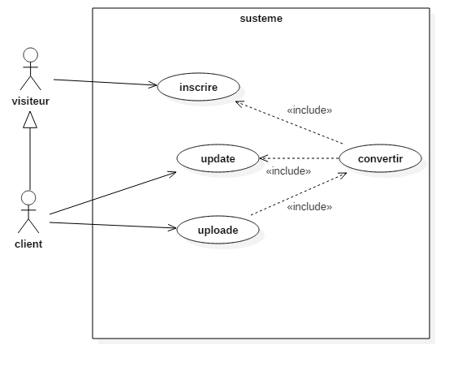
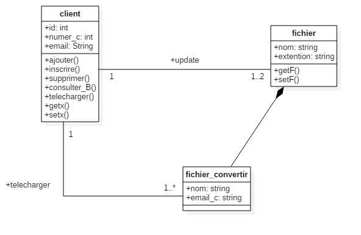

# RAPPORT 
## Module : Claude Computing .	
## Mini Projet: 
### Réalisé par:
*- Bouhidel Selsabil Ines G01.
*- Belkacem Kahlouli Fares G01
1. Objectif de TP: Déveloper une applicatin préte pour l cloud de conversion de document.
###Présentation #

 ### L’architecture globale de l’application  
 La technologie « client/serveur » rend directement accessible au consommateur , les informations détendue par les fournisseurs  
Par exemple dans notre cas une bibliothèque offre a ces clients la possibilité de convertir leurs documente (.txt ,.ppt…)par divers moyens :
+Mobile (wap-wml)
+Internet (http-html)   

Dans cette mise en ouvre applicative on parle De transformation et d’agrégations de d’informations, les applications réalisant ces taches de façon complètement automatique et apique sont les services web  
Alors notre architecture globales et sous la forme d’un ensemble des services web sur la base d’architecture REST 

 ### L’architecture de la couche de donnée 
 ### Élaboration du diagramme d’utilisateur 
     2.1.1.  Élaboration du diagramme d’utilisateur 
       
     2.1.2. Elaboration du diagramme de classes 
       
 
 
3. Déroulement du système :
	Visiteur :
   A : S’authentifier
   C : Effectuer une opération
   E : Afficher la page de l’option choisi
   F : Sauvegarder les nouvelles infos
Client :
   S : S’authentifier
   T : choisir une option (consulter son Boite, ajouter des fichiers)
   U : Effectuer une opération
   W : Afficher la page d’option choisi
   X : Sauvegarder les nouveaux changements 
4. Présentation de l’environnement de développement :
  4.1. Plateforme logicielle

 
  

### la manière de gestion des demandes de clients  : 
Pour la manière de gestion des demandes de clients on va utiliser un contrôleur de nombre d’accès et  sur  le site suivant leur  identificateur  
 la technologie utilisable  c’est le langage java avec la plate forme javaEE(serveur tomcat  ou bien glasse fiche5) Et a base de donnée et réaliser sur oracle  a cause des avantages suivantes :   
+ la gestion du cycle de vie (création, destruction) ; 
+le contrôle implicite des transactions ;
 +la transparence des services distribués ; 
+ la sécurité.
  

