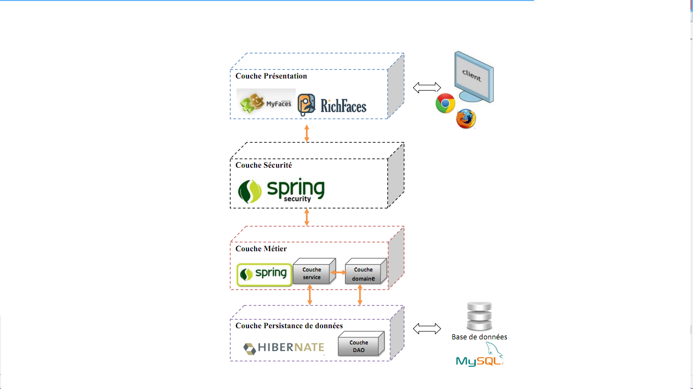

# RAPPORT 
## Module : Claude Computing .	
## Mini Projet: 
### Réalisé par:
*- Bouhidel Selsabil Ines G01.
*- Belkacem Kahlouli Fares G01
1. Objectif de TP: Déveloper une applicatin préte pour l cloud de conversion de document.

### Élaboration du diagramme d’utilisateur 
2.1.1.  Élaboration du diagramme d’utilisateur 

2.1.2. Elaboration du diagramme de classes 
       

 

 ### L’architecture globale de l’application  
 dans notre cas une bibliothèque offre a ces clients la possibilité de convertir leurs documente (.txt ,.ppt…)par divers moyens :
+Mobile (wap-wml)
+Internet (http-html) 
alors architecture globales et sous la forme d’un ensemble des services web sur la base d’architecture REST 

3. Déroulement du système :

Visiteur :

A : S’authentifier

C : Effectuer une opération

E : Afficher la page de l’option choisi

F : Sauvegarder les nouvelles infos

Client :

S : S’authentifier

T : choisir une option (consulter son Boite, ajouter des fichiers)

U : Effectuer une opération

W : Afficher la page d’option choisi

X : Sauvegarder les nouveaux changements

4. Présentation de l’environnement de développement :

### L’architecture de la couche de donnée

4.1. Plateforme logicielle
       
4.1.2:

