# RAPPORT 
## Module : Claude Computing .	
## Mini Projet: 
### Réalisé par:
###### *-Bouhidel Selsabil Ines G01. 
###### *- Belkacem Kahlouli Fares G01

## 1.Objectif de TP: 
Déveloper une applicatin préte pour l cloud de conversion de document.

### 1:Architecteure globale de application:
Nous utilisons l'architecture MVC, les rôles des trois entités sont les suivants :

###### 1 :  modèle : données (accès et mise à jour)

###### 2 : vue : interface utilisateur (entrées et sorties)

###### 3 :contrôleur : gestion des événements et synchronisation

#### 1:Modèle:
contient les données manipulées par le programme et fait la mise a jour sur Data base (insertion ,suppression, changement)
##### 1.2:  Data base contient:
+table de client 

+table des fichiers

+table des fichier convertir

#### 2:Vue:
c'est  l'interface  graphique entre  l'utilisateur et le systeme .

+ l'interface de d'accueil

+l interface de inscription 

+l interface de login

+l interface de convertissions 

#### 3:Contrôleur:
Le contrôleur est chargé de la synchronisation du modèle et de la vue.
Il reçoit tous les événements de l'utilisateur et enclenche les actions à effectuer. Si une action nécessite un changement des données, 
le contrôleur demande la modification des données au modèle et ensuite avertit la vue que les données ont changé pour que celle-ci se mette à jour.
il contient les demandes:(request)

A:demande : inscription (recuperation de formulaire)

B:demande : login (authentifier)

C:demande : convertir le fichier
       
D:demande: télécharger Le fichier converti

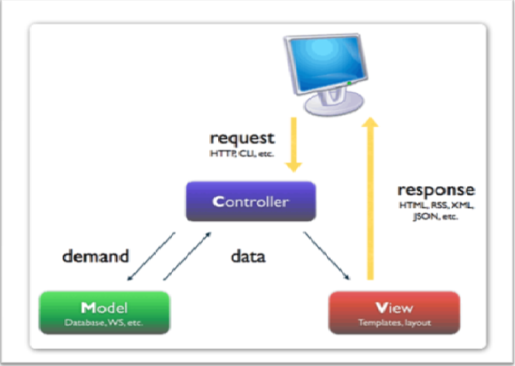

#### 4:En Utilisant servlets:
Les servlets utilisent l'API Java Servlet (package javax.servlet ). Un ou une servlet s'exécute dynamiquement sur le serveur web et permet l'extension des fonctions de ce dernier, par exemple : l'accès à des bases de données, transactions de commerce en ligne

### L’architecture de la couche de donnée
1.2
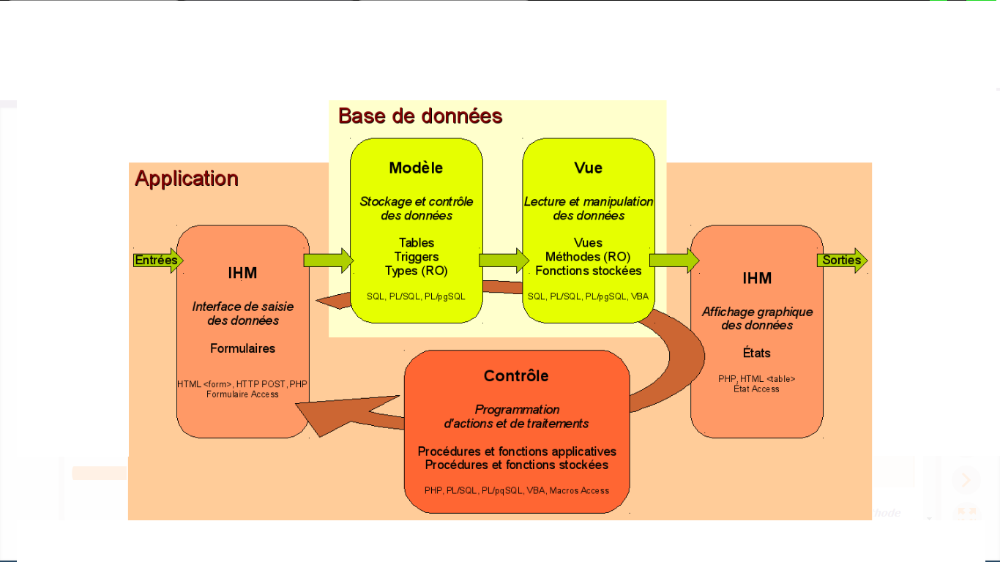
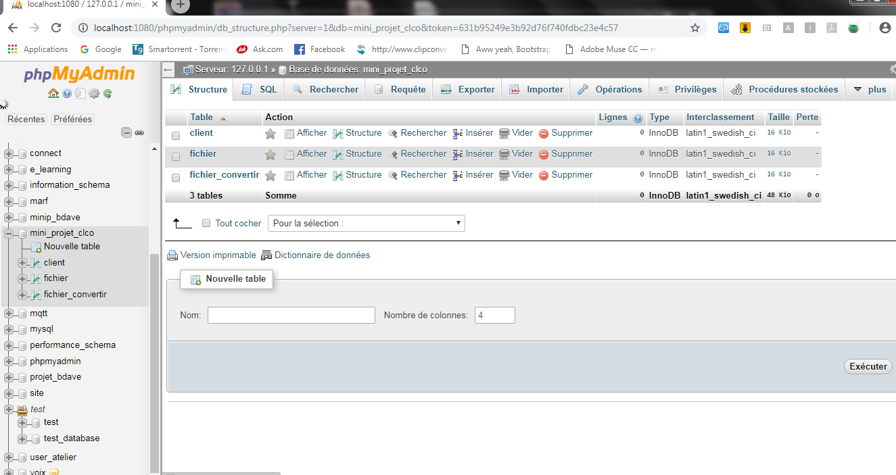
##### Élaboration du diagramme d’utilisateur 
1.  Élaboration du diagramme d’utilisateur 

1.3
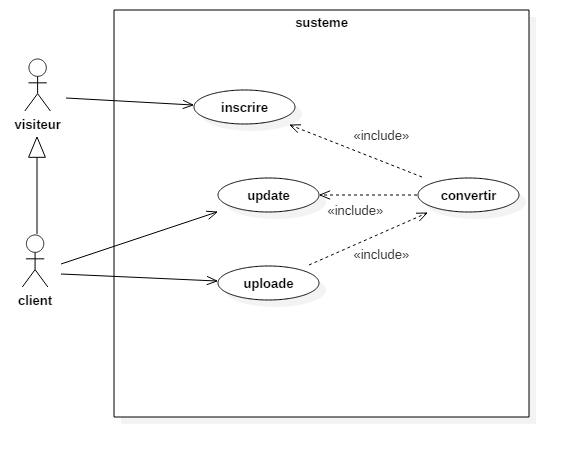

1.1.  Déroulement du système :

Visiteur :

A : S’authentifier

C : Effectuer une opération

E : Afficher la page de l’option choisi

F : Sauvegarder les nouvelles infos

Client :

S : S’authentifier

T : choisir une option (consulter son Boite, ajouter des fichiers)

U : Effectuer une opération

W : Afficher la page d’option choisi

X : Sauvegarder les nouveaux changements

2. Elaboration du diagramme de classes 

 1.4
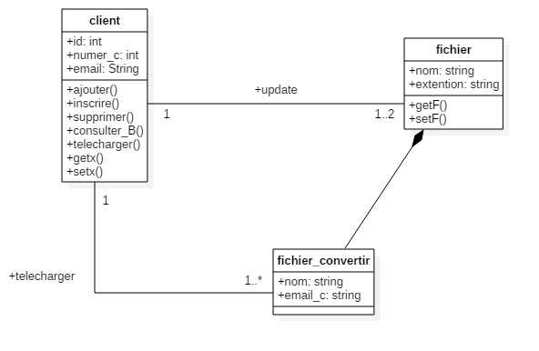
 
 ### la maniére de gestion des demandes des clients
 ###### les interactions avec le systeme 
 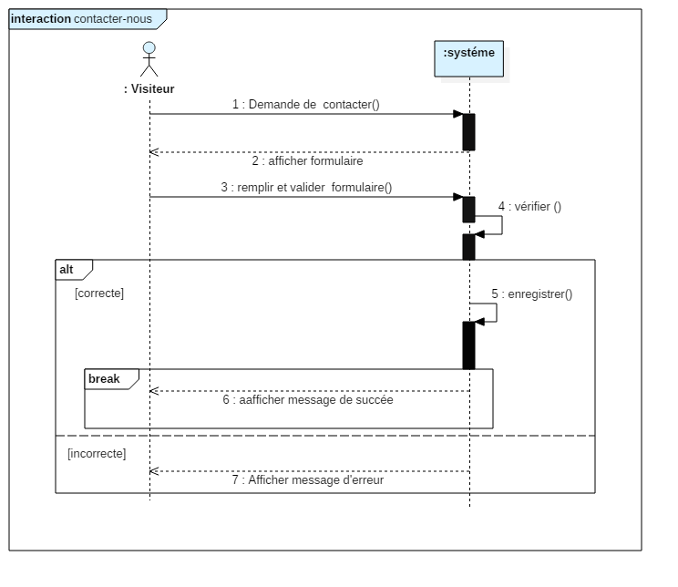
 
 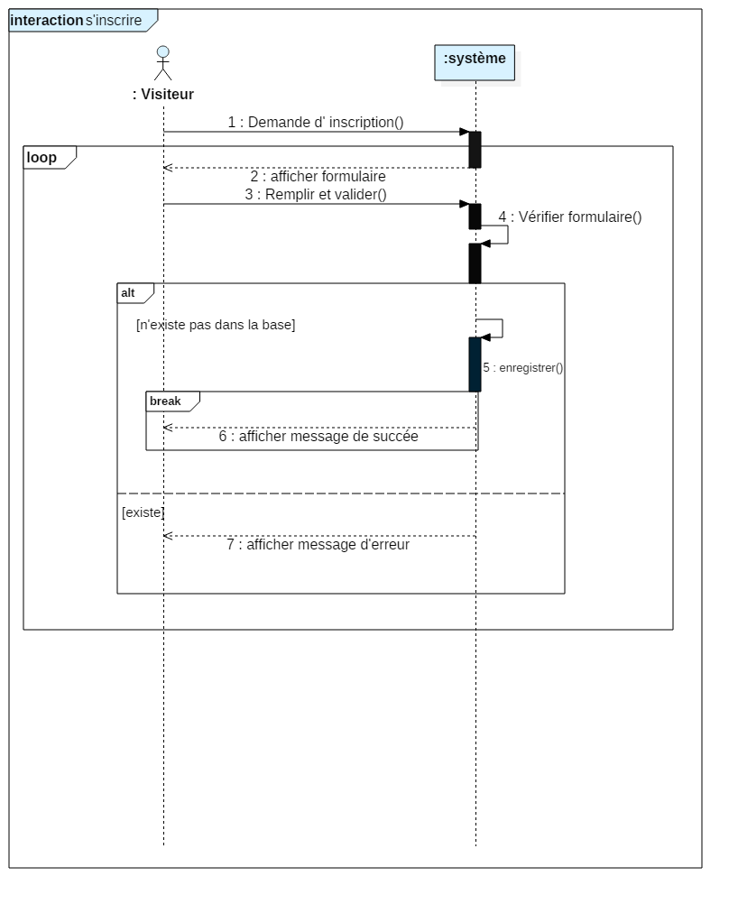
 
 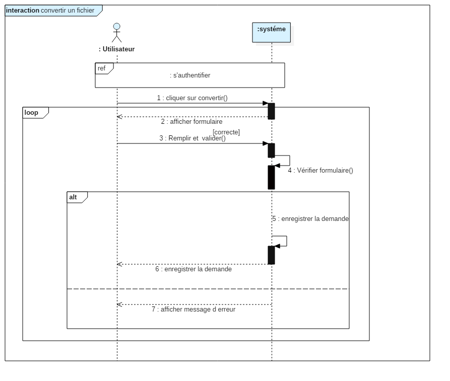
 
 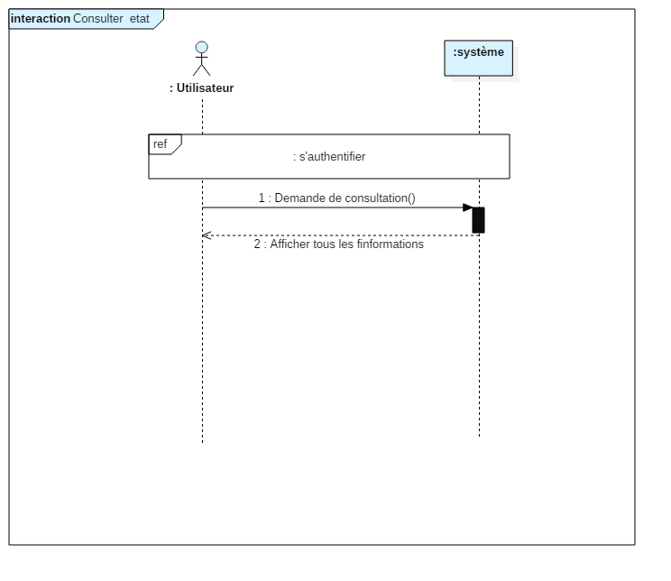
 
 ###### les interactions avec le systeme detaille 
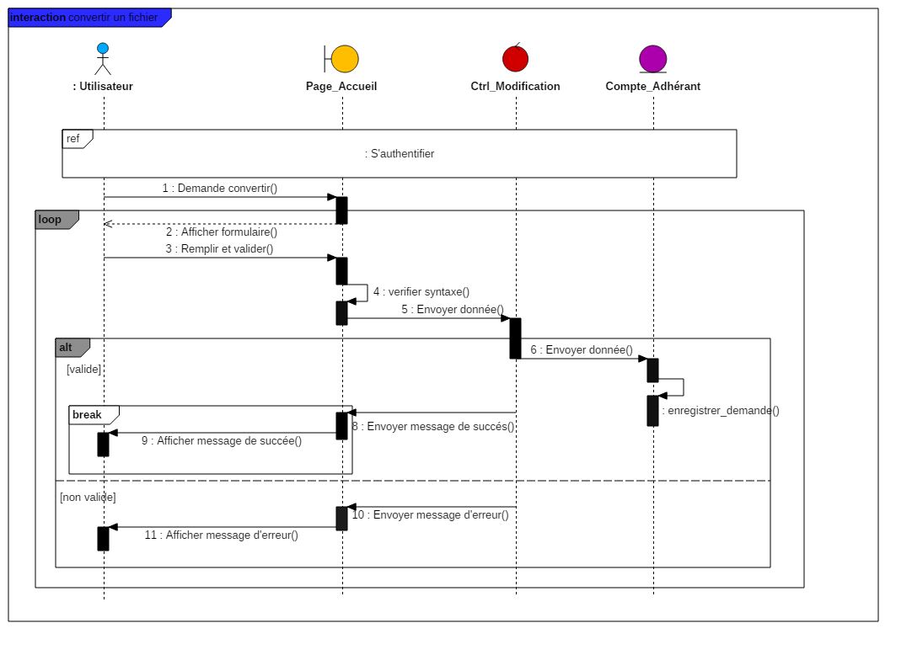

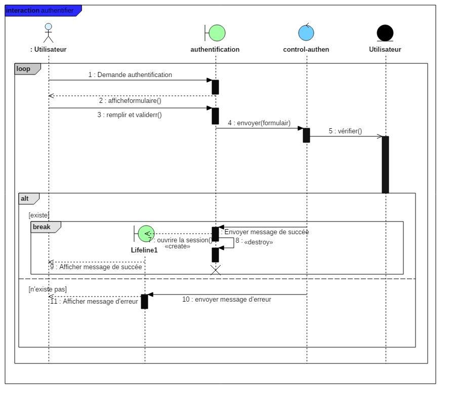

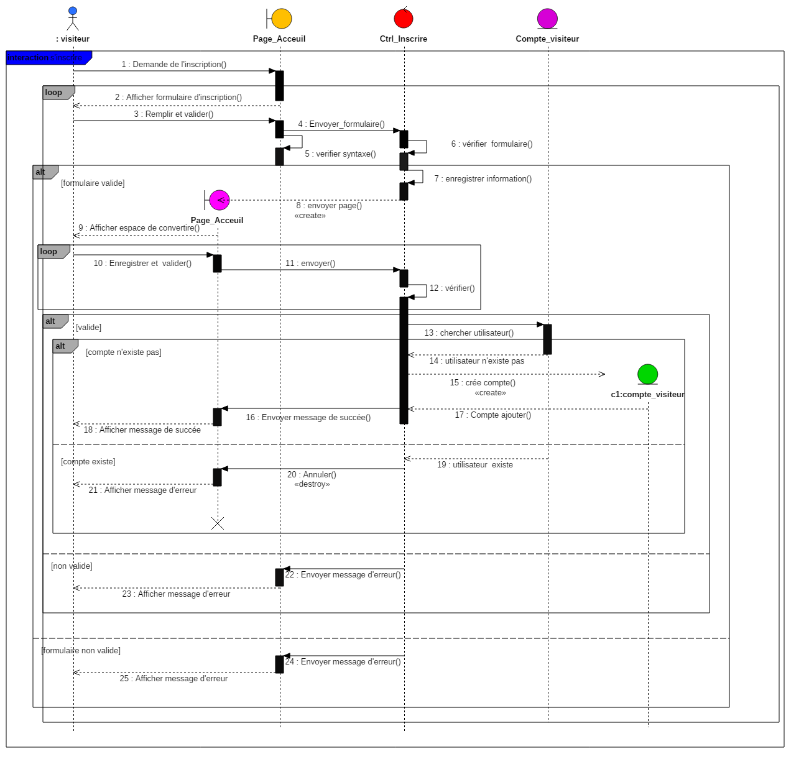

### l technologer choisies:  
Nous utilisons java Spring 
###### Spring 
est un socle pour le développement d'applications, principalement d'entreprises mais pas obligatoirement. Il fournit de nombreuses fonctionnalités parfois redondantes ou qui peuvent être configurées ou utilisées de plusieurs manières : ceci laisse le choix au développeur d'utiliser la solution qui lui convient le mieux et/ou qui répond aux besoins.
1.12
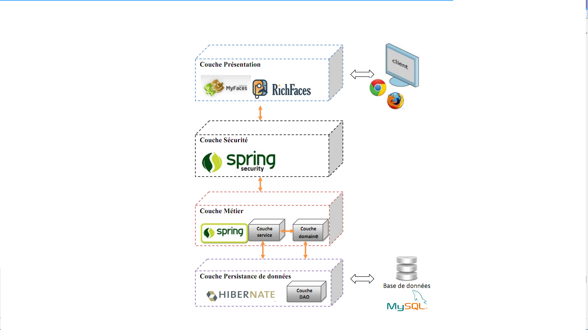

 ###### Plateforme logicielle
  
 +GitHub
 
 +Xampp : XAMPP  Lite  version 1.7.3
 
 +MySQL /phpMyAdmin 

