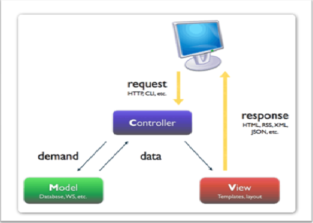
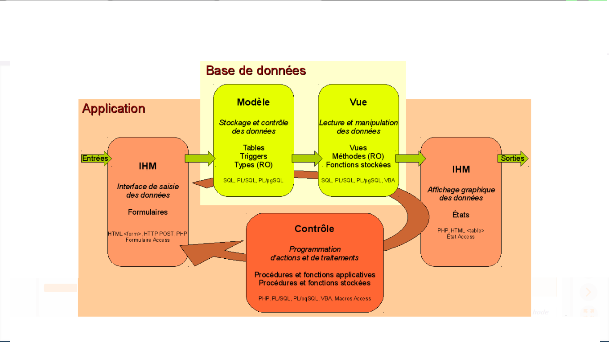

# RAPPORT 
## Module : Claude Computing .	
## Mini Projet: 
### Réalisé par:
###### - Bouhidel Selsabil Ines G01. 
###### *- Belkacem Kahlouli Fares G01

## 1.Objectif de TP: 
Déveloper une applicatin préte pour l cloud de conversion de document.

### 1:Architecteure globale de application:
Nous utilisons l'architecture MVC, les rôles des trois entités sont les suivants :
   	1 :  modèle : données (accès et mise à jour) 
   	2 : vue : interface utilisateur (entrées et sorties)
   	3 :contrôleur : gestion des événements et synchronisation
#### 1:Modèle:
contient les données manipulées par le programme et fait la      mise a jour sur Data base (insertion ,suppression, changement)
       1.2:  Data base contient:
            -les identifient de utilisateur (id, nom ,prénom, email ,mot de passe )  .
            -les emplacement de fichier convertir ( PATH ).
            -nombre de visiteur(id int).  
#### 2:Vue:
La vue fait l'interface avec l'utilisateur (HTML,RSS,XML).
Sa première tâche est d'afficher les données qu'elle a récupérées auprès du modèle il contient:
        -l interface de inscription 
        -l interface de login 
        -l interface de convertissions 

#### 3:Contrôleur:
Le contrôleur est chargé de la synchronisation du modèle et de la vue.
Il reçoit tous les événements de l'utilisateur et enclenche les actions à effectuer. Si une action nécessite un changement des données, 
le contrôleur demande la modification des données au modèle et ensuite avertit la vue que les données ont changé pour que celle-ci se mette à jour.
il contient les demandes:(request)
      A:demande : inscription (nom, prénom, âge , email, mot de passe, confirmation mot passe )
      B:demande : login (email  ou nom de utilisateur, mot de passe )
      C:demande : convertir le fichier  
	  D:demande : mettre à jour 
      E:demande: télécharger Le fichier converti

### Élaboration du diagramme d’utilisateur 
2.1.1.  Élaboration du diagramme d’utilisateur 

2.1.2. Elaboration du diagramme de classes 
       

 
3. Déroulement du système :

Visiteur :

A : S’authentifier

C : Effectuer une opération

E : Afficher la page de l’option choisi

F : Sauvegarder les nouvelles infos

Client :

S : S’authentifier

T : choisir une option (consulter son Boite, ajouter des fichiers)

U : Effectuer une opération

W : Afficher la page d’option choisi

X : Sauvegarder les nouveaux changements

### L’architecture globale de l’application  
dans notre cas une bibliothèque offre a ces clients la possibilité de convertir leurs documente (.txt ,.ppt…)par divers moyens :
+Mobile (wap-wml)
+Internet (http-html) 
alors architecture globales et sous la forme d’un ensemble des services web sur la base d’architecture REST 

4. Présentation de l’environnement de développement :
4.1. Plateforme logicielle
+GitHub

+Xampp : XAMPP  Lite  version 1.7.3

+MySQL /phpMyAdmin 
### L’architecture de la couche de donnée

